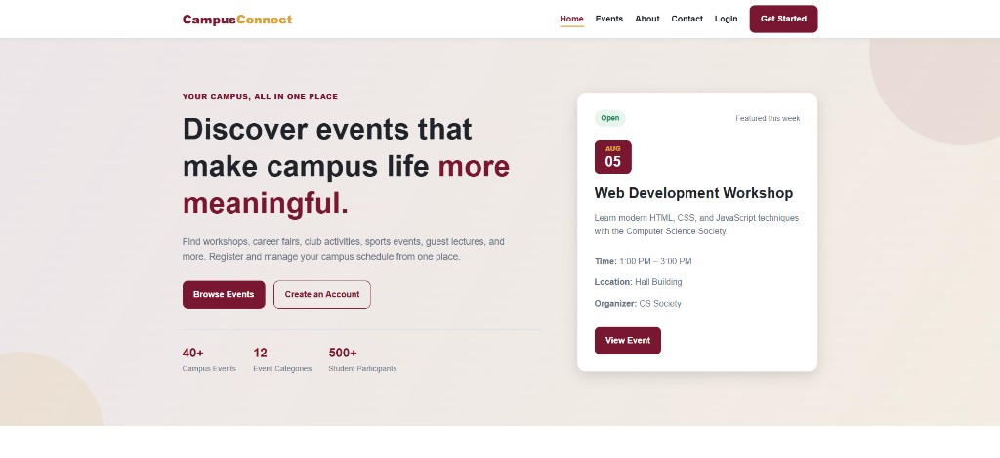

# CampusConnect — Smart Campus Event Planner

A web-based campus event planning application for **SOEN 287: Web Programming (Summer 2026)**. CampusConnect helps students discover campus events, register for activities, and manage their event schedule, while giving organizers tools to create and manage events.

This repository contains **Deliverable 1 (Frontend)** — HTML, CSS, and frontend JavaScript with hard-coded data and simulated interactions.



## Project Overview

University students often miss workshops, career fairs, club activities, and networking events because information is spread across emails, posters, and social media. CampusConnect centralizes event discovery, registration, and management in one place.

### User Roles

- **Student** — browse events, register, view dashboard, manage registrations
- **Admin / Organizer** — create events, manage events, view campus event overview

## Features Implemented (Deliverable 1)

### Public Pages
- Home page with hero section, featured events, and event categories
- About page
- Contact page with frontend form validation
- Shared header, navigation bar, footer, and mobile menu

### Authentication (Frontend Simulation)
- Login page with email, password, and role selection
- Registration page with full name, email, password, confirm password, and role
- Profile page
- Frontend validation for required fields, email format, and password rules
- Simulated login redirect:
  - Student → `views/student-dashboard.html`
  - Admin → `views/admin-dashboard.html`

### Student Pages
- Student dashboard with registered and attended event sections
- Events list page with search and filter controls
- Event details page
- My registrations page with participation summary
- Upcoming events page with registration status badges

### Admin Pages
- Admin dashboard with event statistics and summary table
- Create event page with event form
- Manage events page with event table and action buttons

### Shared Design System
- Colour variables, typography, buttons, cards, forms, badges, and tables in `global.css`
- Responsive layout for desktop and mobile

## Pages

| Page | File |
|------|------|
| Home | `index.html` |
| About | `views/about.html` |
| Contact | `views/contact.html` |
| Login | `views/login.html` |
| Register | `views/register.html` |
| Profile | `views/profile.html` |
| Student Dashboard | `views/student-dashboard.html` |
| Events | `views/events.html` |
| Event Details | `views/event-details.html` |
| My Registrations | `views/my-registrations.html` |
| Upcoming Events | `views/upcoming-events.html` |
| Admin Dashboard | `views/admin-dashboard.html` |
| Create Event | `views/create-event.html` |
| Manage Events | `views/manage-events.html` |

## Project Structure

```
WebConcordia/
├── index.html
├── README.md
│
├── public/
│   ├── css/
│   │   ├── global.css          # Shared styles (all pages)
│   │   ├── public-pages.css    # Home, About, Contact
│   │   ├── auth.css            # Login, Register, Profile
│   │   ├── student.css         # Student dashboard & events
│   │   ├── registrations.css   # My registrations & upcoming events
│   │   └── admin.css           # Admin pages
│   │
│   ├── js/
│   │   ├── main.js             # Mobile navigation & contact form
│   │   ├── auth.js             # Login & registration validation
│   │   └── registrations.js    # Registration page interactions
│   │
│   └── images/
│
└── views/
    ├── about.html
    ├── contact.html
    ├── login.html
    ├── register.html
    ├── profile.html
    ├── student-dashboard.html
    ├── events.html
    ├── event-details.html
    ├── my-registrations.html
    ├── upcoming-events.html
    ├── admin-dashboard.html
    ├── create-event.html
    └── manage-events.html
```

## How to Run

No backend or database is required for Deliverable 1.

1. Clone or download this repository.
2. Open `index.html` in a web browser.

Alternatively, use a local development server (recommended for consistent path behaviour):

```bash
# Using Python
python -m http.server 8000

# Using Node.js (npx)
npx serve .
```

Then open `http://localhost:8000` in your browser.

## Technologies

- HTML5
- CSS3
- JavaScript (vanilla)

## Team Work Distribution

| Member | Responsibility |
|--------|----------------|
| Member 1 — Anh Tuan Dang | Common layout, public pages, `global.css`, navigation, footer |
| Member 2 — Mehran Bordbar | Login, registration, profile, `auth.css`, `auth.js` |
| Member 3 — Najum | Student dashboard, events list, event details, `student.css` |
| Member 4 — Disha | My registrations, upcoming events, `registrations.css`, `registrations.js` |
| Member 5 — Tiago | Admin pages, integration, testing, `admin.css` |

## Notes

- Event data is currently hard-coded for frontend demonstration.
- Login, registration, and event actions are simulated on the client side only.
- Deliverable 2 will replace simulated behaviour with backend functionality.

## Course

**SOEN 287 — Web Programming**  
Concordia University — Summer 2026
