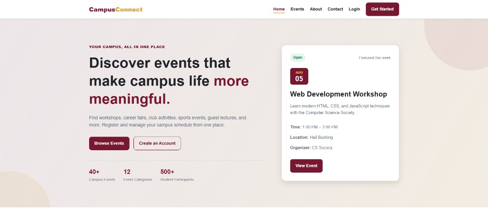

# CampusConnect — Smart Campus Event Planner

A web-based campus event planning application for **SOEN 287: Web Programming (Summer 2026)**. CampusConnect helps students discover campus events, register for activities, and manage their event schedule, while giving organizers tools to create events, manage registrations, track attendance, and view participation statistics.

This repository contains the **complete project** — Deliverable 1 (frontend) and Deliverable 2 (full stack with Node.js, Express, SQLite, authentication, and database-driven features).



## Project Overview

University students often miss workshops, career fairs, club activities, and networking events because information is spread across emails, posters, and social media. CampusConnect centralizes event discovery, registration, and management in one place.

### User Roles

| Role | Capabilities |
|------|--------------|
| **Student** | Browse events, register, cancel registrations, view dashboard and profile |
| **Admin / Organizer** | Create and manage events, view registrations, mark attendance, view statistics |

---

## Deliverable 1 — Frontend (Completed)

Deliverable 1 focused on the user interface: HTML pages, CSS styling, navigation, forms, and responsive layout. Data could be hard-coded; no backend or database was required.

### Features Implemented

**Public pages**
- Home page with hero section, featured events, and event categories
- About page
- Contact page with form validation
- Shared header, navigation bar, footer, and mobile menu

**Authentication pages**
- Login page (email, password, role selection)
- Registration page (full name, email, password, confirm password, role)
- Profile page
- Frontend validation for required fields, email format, and password rules

**Student pages**
- Student dashboard with event summary and registered-event views
- Events list page with search and filter controls
- Event details page
- My registrations page with participation summary
- Upcoming events page with registration status badges

**Admin pages**
- Admin dashboard with event statistics and summary table
- Create event page with event form
- Manage events page with event table and action buttons
- Edit event, view registrations, and attendance management pages

**Shared design system**
- Colour variables, typography, buttons, cards, forms, badges, and tables in `global.css`
- Page-specific styles in `public-pages.css`, `auth.css`, `student.css`, `registrations.css`, and `admin.css`
- Responsive layout for desktop and mobile

---

## Deliverable 2 — Full Stack (Completed)

Deliverable 2 added backend logic, database storage, authentication, role-based access, server-side validation, and API integration for all core features.

### Features Implemented

**Account management**
- User registration and login with bcrypt password hashing
- Session-based authentication (`express-session`)
- Profile updates (name, email, password)
- Duplicate email prevention and server-side validation

**Event management**
- Database-driven events, categories, and filters
- Search and filter by category, date, location, organizer, and status
- Event statuses: Open, Full, Cancelled, Completed, Disabled
- Server-side capacity calculations and registration limits

**Registration workflow**
- Students register for open events (blocked when full, cancelled, disabled, or past)
- Cancel own registrations with automatic capacity updates
- Registration statuses: Registered, Cancelled, Attended, Missed

**Student dashboard**
- Summary statistics (registered events, events this week, categories, campus events)
- Views for registered, suggested, upcoming, attended, and cancelled events
- Participation summary on My Registrations

**Admin dashboard**
- Campus-wide statistics (totals, upcoming, full, cancelled events)
- Attendance summary and registrations by category
- Seat-fill percentage per event
- Create, edit, cancel, disable, and delete events
- View registrations and mark attendance (Attended / Missed)

**Technical**
- SQLite database with `users`, `events`, `registrations`, and `categories` tables
- Modular structure: routes, controllers, models, middleware, validation
- Jest + Supertest API tests in `tests/`
- Installation and user documentation

---

## Pages

| Page | URL | File |
|------|-----|------|
| Home | `/` | `index.html` |
| About | `/about` | `views/about.html` |
| Contact | `/contact` | `views/contact.html` |
| Login | `/login` | `views/login.html` |
| Register | `/register` | `views/register.html` |
| Profile | `/profile` | `views/profile.html` |
| Events | `/events` | `views/events.html` |
| Event Details | `/event-details` | `views/event-details.html` |
| Student Dashboard | `/student/dashboard` | `views/student-dashboard.html` |
| My Registrations | `/student/my-registrations` | `views/my-registrations.html` |
| Upcoming Events | `/student/upcoming-events` | `views/upcoming-events.html` |
| Admin Dashboard | `/admin/dashboard` | `views/admin-dashboard.html` |
| Create Event | `/admin/create-event` | `views/create-event.html` |
| Manage Events | `/admin/manage-events` | `views/manage-events.html` |
| Edit Event | `/admin/edit-event` | `views/edit-event.html` |
| View Registrations | `/admin/view-registrations` | `views/view-registrations.html` |
| Attendance Management | `/admin/attendance-management` | `views/attendance-management.html` |

Legacy `/views/*.html` URLs redirect to the canonical routes above where applicable.

---

## Project Structure

```
WebConcordia/
├── app.js                          # Express server entry point
├── index.html                      # Home page
├── package.json
├── .env.example
├── README.md
├── INSTALLATION-GUIDE.md
├── USER-GUIDE.md
│
├── public/
│   ├── css/
│   │   ├── global.css              # Shared styles (all pages)
│   │   ├── public-pages.css        # Home, About, Contact
│   │   ├── auth.css                # Login, Register, Profile
│   │   ├── student.css             # Student dashboard & events
│   │   ├── registrations.css       # My registrations & upcoming events
│   │   └── admin.css               # Admin pages
│   ├── js/
│   │   ├── main.js                 # Mobile navigation & contact form
│   │   ├── auth.js                 # Login, registration, profile
│   │   ├── events.js               # Events list, filters, student dashboard
│   │   ├── event-details.js        # Event details page
│   │   ├── registrations.js        # Registration & cancellation
│   │   └── admin.js                # Admin dashboard & event management
│   └── images/
│
├── views/                          # HTML page templates
│
├── routes/
│   ├── publicRoutes.js             # Public pages & contact API
│   ├── authRoutes.js               # Authentication API
│   ├── eventRoutes.js              # Events API
│   ├── registrationRoutes.js       # Registrations API
│   ├── adminRoutes.js              # Admin API
│   ├── adminPageRoutes.js          # Admin HTML pages
│   ├── studentPageRoutes.js        # Student HTML pages
│   └── studentRoutes.js            # Student dashboard API
│
├── controllers/
│   ├── publicController.js
│   ├── authController.js
│   ├── eventController.js
│   ├── registrationController.js
│   ├── adminController.js
│   └── studentController.js
│
├── models/
│   ├── User.js
│   ├── Event.js
│   └── Registration.js
│
├── middleware/
│   ├── authMiddleware.js
│   ├── roleMiddleware.js
│   ├── validationMiddleware.js
│   └── errorMiddleware.js
│
├── validation/
│   ├── authValidation.js
│   ├── eventValidation.js
│   └── registrationValidation.js
│
├── database/
│   ├── database.js
│   ├── schema.sql
│   ├── initializeDatabase.js
│   ├── seed.js
│   └── campusconnect.db            # Created after db:init
│
└── tests/
    ├── admin.test.js
    ├── events.test.js
    └── registrations.test.js
```

---

## How to Run

The application must be started through the Express server. Do **not** open `index.html` directly in the browser.

```bash
npm install
npm run db:init
npm run db:seed
npm start
```

Open [http://localhost:3000](http://localhost:3000) in your browser.

For development with automatic restart:

```bash
npm run dev
```

See [INSTALLATION-GUIDE.md](INSTALLATION-GUIDE.md) for full setup instructions and [USER-GUIDE.md](USER-GUIDE.md) for usage instructions.

### Default Test Accounts

| Role | Email | Password |
|------|-------|----------|
| Student | `student@test.com` | `password123` |
| Admin | `admin@test.com` | `password123` |

### Useful Commands

| Command | Purpose |
|---------|---------|
| `npm install` | Install dependencies |
| `npm start` | Start the server |
| `npm run dev` | Start with nodemon (auto-restart) |
| `npm run db:init` | Create database tables |
| `npm run db:seed` | Insert sample data |
| `npm test` | Run API tests |

---

## API Routes

### Public

| Method | Route | Description |
|--------|-------|-------------|
| GET | `/api/health` | Server health check |
| POST | `/api/contact` | Submit contact form |
| GET | `/api/public/featured-events` | Featured events for home page |
| GET | `/api/public/events` | List public events |
| GET | `/api/public/events/:id` | Event details |
| GET | `/api/public/upcoming-events` | Upcoming events |

### Authentication

| Method | Route | Description |
|--------|-------|-------------|
| POST | `/api/auth/register` | Create account |
| POST | `/api/auth/login` | Log in |
| POST | `/api/auth/logout` | Log out |
| GET | `/api/auth/me` | Current user info |
| PUT | `/api/auth/profile` | Update profile |
| PUT | `/api/auth/password` | Change password |

### Events

| Method | Route | Description |
|--------|-------|-------------|
| GET | `/api/events` | List events (with filters) |
| GET | `/api/events/filter-options` | Categories, locations, organizers, statuses |
| GET | `/api/events/details/:eventId` | Event details |
| GET | `/api/events/suggested` | Suggested events (student, logged in) |

### Registrations (Student)

| Method | Route | Description |
|--------|-------|-------------|
| POST | `/api/registrations` | Register for an event |
| GET | `/api/registrations/my` | My registrations |
| GET | `/api/registrations/upcoming` | Upcoming registered events |
| GET | `/api/registrations/summary` | Participation summary |
| PATCH | `/api/registrations/:registrationId/cancel` | Cancel registration |

### Student Dashboard

| Method | Route | Description |
|--------|-------|-------------|
| GET | `/api/student/dashboard/summary` | Dashboard statistics |
| GET | `/api/student/dashboard/events` | Registered events for dashboard |

### Admin

| Method | Route | Description |
|--------|-------|-------------|
| GET | `/api/admin/dashboard` | Dashboard statistics |
| GET | `/api/admin/events` | All events for management |
| POST | `/api/admin/events` | Create event |
| PUT | `/api/admin/events/:eventId` | Edit event |
| PATCH | `/api/admin/events/:eventId/status` | Cancel, disable, or reopen event |
| DELETE | `/api/admin/events/:eventId` | Delete event (no active registrations) |
| GET | `/api/admin/events/:eventId/registrations` | Event registrations |
| PATCH | `/api/admin/registrations/:registrationId/attendance` | Mark attendance |

---

## Technologies

| Layer | Technologies |
|-------|--------------|
| Frontend | HTML5, CSS3, JavaScript (vanilla) |
| Backend | Node.js, Express |
| Database | SQLite |
| Auth & Security | bcrypt, express-session |
| Validation | express-validator |
| Testing | Jest, Supertest |

---

## Team Work Distribution

| Member | Responsibility |
|--------|----------------|
| Member 1 — Anh Tuan Dang | Common layout, public pages, `global.css`, navigation, footer |
| Member 2 — Mehran Bordbar | Login, registration, profile, `auth.css`, `auth.js` |
| Member 3 — Najum Avur Mammu | Student dashboard, events list, event details, `student.css` |
| Member 4 — Disha | My registrations, upcoming events, `registrations.css`, `registrations.js` |
| Member 5 — Tiago | Admin pages, integration, testing, `admin.css` |

---

## Documentation

| Document | Description |
|----------|-------------|
| [INSTALLATION-GUIDE.md](INSTALLATION-GUIDE.md) | Setup, database, and running the application |
| [USER-GUIDE.md](USER-GUIDE.md) | How to use the website (student and admin) |

---

## Course

**SOEN 287 — Web Programming**  
Concordia University — Summer 2026
